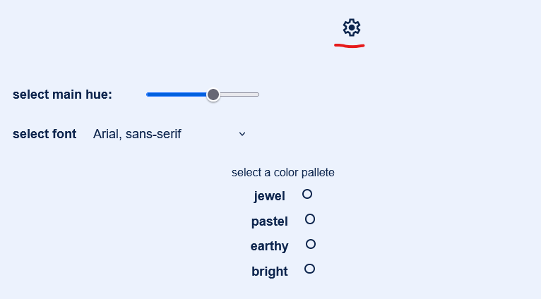

# rmc
A new project for a consulting business.

This web-app is built with Python Flask backend
JavaScript uses fetch to to render html templates & other data.

Deployed via heroku
[rmc-text](https://rmc-test-c7b678a83204.herokuapp.com/)

### Features

Color and font exploration (wip)
    Use the slider to pick a main hue/color
    Select from pre-determined fonts to determine general style
    Select a main color pallete to determine the tone/feel for the site

    When finding a good combonation, take a screenshot
        Then we can expand upon that baseline.

    Todo:
        Known issues:
            Resolve pallete issues (jewel is only one that turns text white)
            Slider is wonky at lower ranges
            Refresh does not keep changes

        Add more functionality
            Should be able to save a theme/set preferences
        

